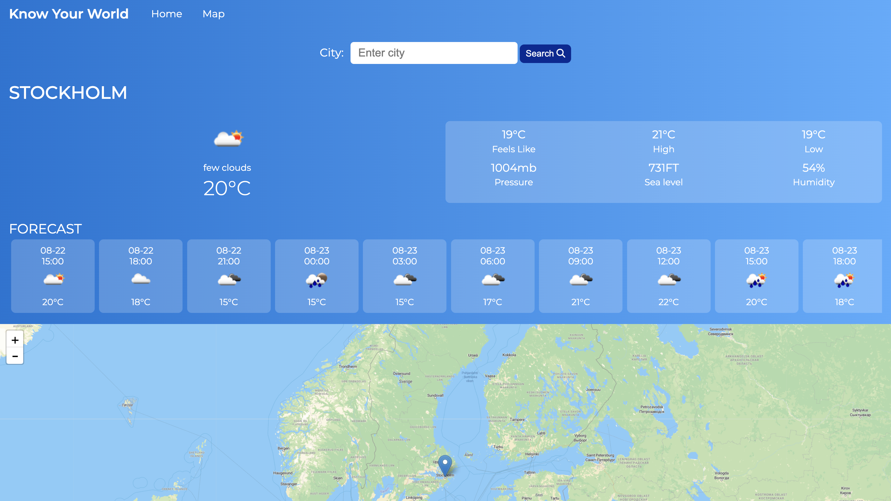
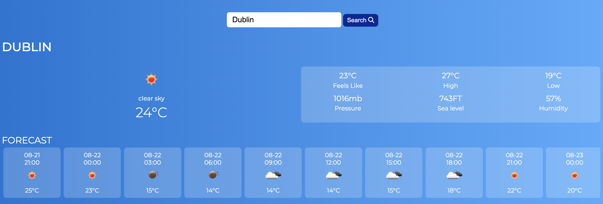
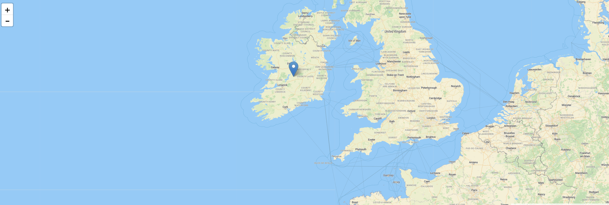
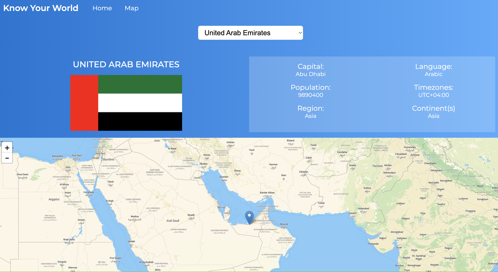
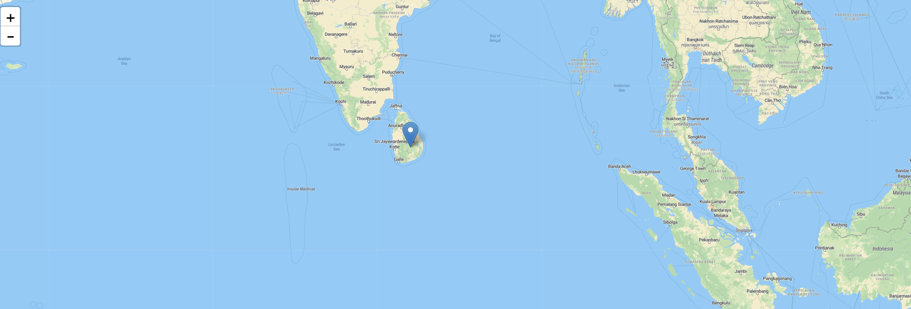
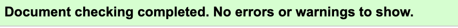
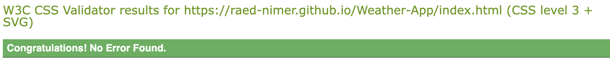
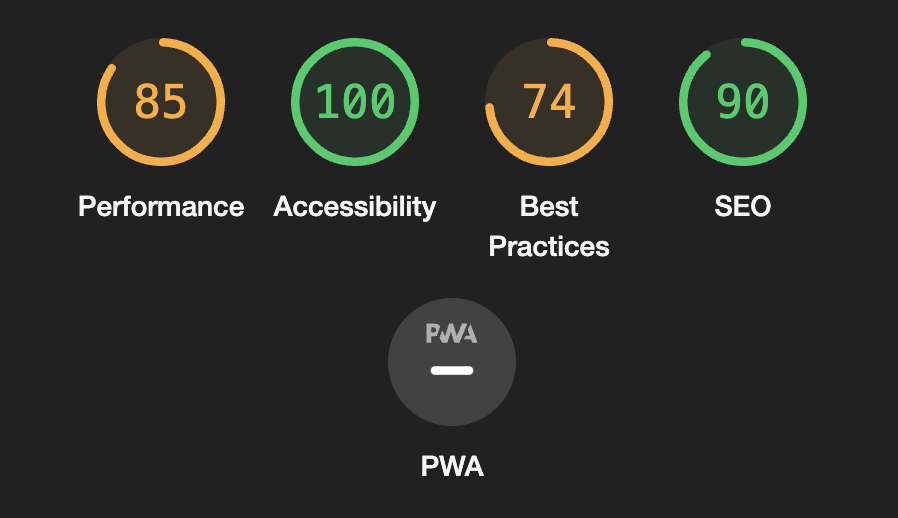

# Weather-App

"Know Your World" stands out as a multifaceted weather application, offering users a comprehensive experience beyond just weather updates. In addition to providing detailed forecasts for any city globally, the app's unique country section elevates the user experience by integrating valuable insights about countries worldwide. By seamlessly blending weather data with geographical knowledge, users can explore countries on an interactive map, uncovering key details such as capitals, languages spoken, population statistics, timezones, regions, and continents where the countries are situated. This innovative fusion of weather and geographical information equips users with a holistic understanding of the world around them, empowering them to make informed decisions and deepen their global awareness. Embrace the full potential of "Know Your World" to stay informed, explore, and broaden your horizons effortlessly.

[Live webpage](https://raed-nimer.github.io/Weather-App/index.html)

# Tools and technologies used

## Languages

- [HTML](https://web.dev/learn/html/overview/) was used to provide structure for the project
- [CSS](https://developer.mozilla.org/en-US/docs/Web/CSS) was used to style the HTML elements
- [JavaScript](https://developer.mozilla.org/en-US/docs/Web/JavaScript) was used to add functionallty to the app

## Other tools

- [Visual Studio Code](https://code.visualstudio.com/) was used to write the code for the application
- [GitHub](https://github.com/) is the platform used to host the code for the website
- [Git](https://git-scm.com/) was used as a version control software to commit and push the code to the GitHub repository
- [Google Chrome Developer Tools](https://developer.chrome.com/docs/devtools/overview/) was used during testing, debugging and making the website responsive
- [Fontawesome](https://fontawesome.com/) was used to add icons into the application
- [Google Fonts](https://fontawesome.com/) was used to get external fonts
- [Fresh Background Grients](https://webgradients.com/) was used to add grients to the application
- [W3C HTML Validator](https://validator.w3.org/) was used to check for errors in the HTML code
- [W3C CSS Validator](https://jigsaw.w3.org/css-validator/) was used to check for errors in the CSS code

## features

##### Header

- Header of the page
- contains links to home and maps page
  

### Home page

Home page includes a search bar, live weather information, three hour forecast for any country or city in the world and a map showing you the exact location you search for 

##### Weather Section

The weather section contains more detailed description like:

- What the weather feels like
- Max temperature
- Min temperature
- Pressure
- Sea level
- Humidity.

##### Maps Section

The map on the home page marks the location you search for creating a more engaging experience

### Maps page

The map page gives a detailed overview of the selected country, and displays the country's location on the map.

##### Country Details Section

the country details section displays the following information of the selected country:

- Flag
- Capital
- language
- Population
- Timezones
- Region
- Continent

##### Maps Section

The maps section displays the selected country's location on the map

## Testing

The website was tested on devices and with various tools

### Validator Testing

##### HTML

HTML validation was preformed using the official [W3C validator](https://validator.w3.org/nu/?doc=https%3A%2F%2Fraed-nimer.github.io%2FWeather-App%2Findex.html). There were errors regarding alt attribute on images and missing labels. All errors were immediately fixed.

##### CSS

CSS validation was preformed using the official [(Jigsaw) validator](https://jigsaw.w3.org/css-validator/validator?uri=https%3A%2F%2Fraed-nimer.github.io%2FWeather-App%2Findex.html&profile=css3svg&usermedium=all&warning=1&vextwarning=&lang=en#warnings). There was an error regarding the contrast of button and text. All errors were immediately fixed.

##### Responsiveness

This website was tested on the following devices:

- Macbook
- desktop pc
- IPad 6th and 10th generation
- iPhone SE, iPhone 12 and iPhone 13.

And the responsiveness looked all good.

##### Lighthouse

### Interesting Bugs or Problems

### unfixed Bugs

After conducting thorough testing using different online tools and devices, all identified warnings and errors have been rectified

### Deployment

##### Deploy with GitHub Pages.

The steps to deploy are as follows:

- Navigate to the [repository](https://github.com/raed-nimer/Weather-App)
- Click on Settings on the top.
- Click on Pages on the menu on the left which will open GitHub Pages window.
- From the drop down menu under source select deploy from branch.
- From the drop down menu under branch select main, this tells GitHub which branch to use for the deployment. Click Save.
- The page should refresh and the deployment link should appear.

## Credits
