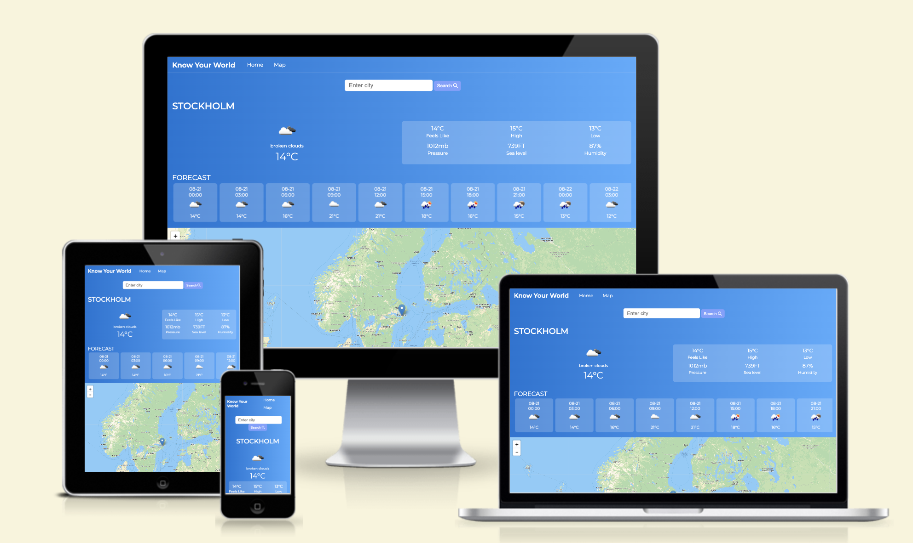

# Weather-App

"Know Your World" stands out as a multifaceted weather application, offering users a comprehensive experience beyond just weather updates. In addition to providing detailed forecasts for any city globally, the app's unique country section elevates the user experience by integrating valuable insights about countries worldwide. By seamlessly blending weather data with geographical knowledge, users can explore countries on an interactive map, uncovering key details such as capitals, languages spoken, population statistics, timezones, regions, and continents where the countries are situated. This innovative fusion of weather and geographical information equips users with a holistic understanding of the world around them, empowering them to make informed decisions and deepen their global awareness. Embrace the full potential of "Know Your World" to stay informed, explore, and broaden your horizons effortlessly.

[Live webpage](https://raed-nimer.github.io/Weather-App/index.html)

# Tools and technologies used

## Languages

- [HTML](https://web.dev/learn/html/overview/) was used to provide structure for the project
- [CSS](https://developer.mozilla.org/en-US/docs/Web/CSS) was used to style the HTML elements
- [JavaScript](https://developer.mozilla.org/en-US/docs/Web/JavaScript) was used to add functionallty to the app

## Other tools

- [Visual Studio Code](https://code.visualstudio.com/) was used to write the code for the application
- [GitHub](https://github.com/) is the platform used to host the code for the website
- [Git](https://git-scm.com/) was used as a version control software to commit and push the code to the GitHub repository
- [Google Chrome Developer Tools](https://developer.chrome.com/docs/devtools/overview/) was used during testing, debugging and making the website responsive
- [Fontawesome](https://fontawesome.com/) was used to add icons into the application
- [Google Fonts](https://fontawesome.com/) was used to get external fonts
- [Fresh Background Grients](https://webgradients.com/) was used to add grients to the application
- [W3C HTML Validator](https://validator.w3.org/) was used to check for errors in the HTML code
- [W3C CSS Validator](https://jigsaw.w3.org/css-validator/) was used to check for errors in the CSS code

## features 

##### Header
- Header of the page 
- contains links to home and maps page

### Home page

##### Weather section

### Maps page

